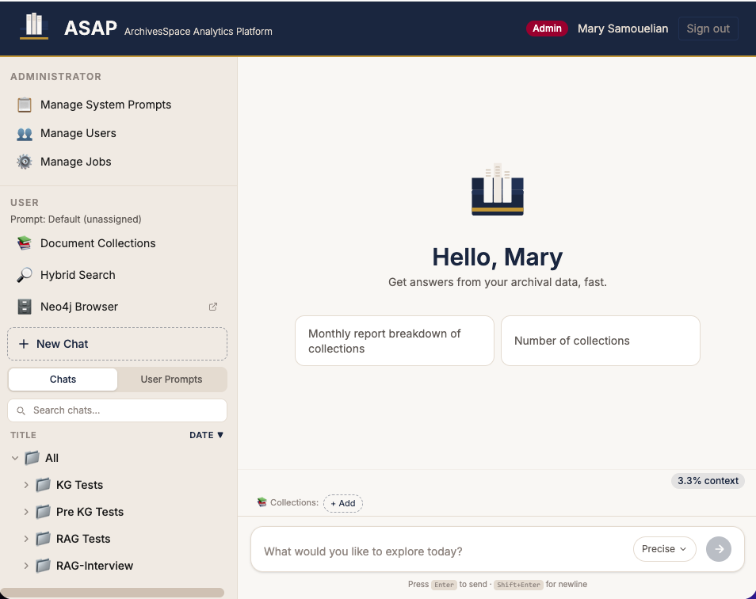
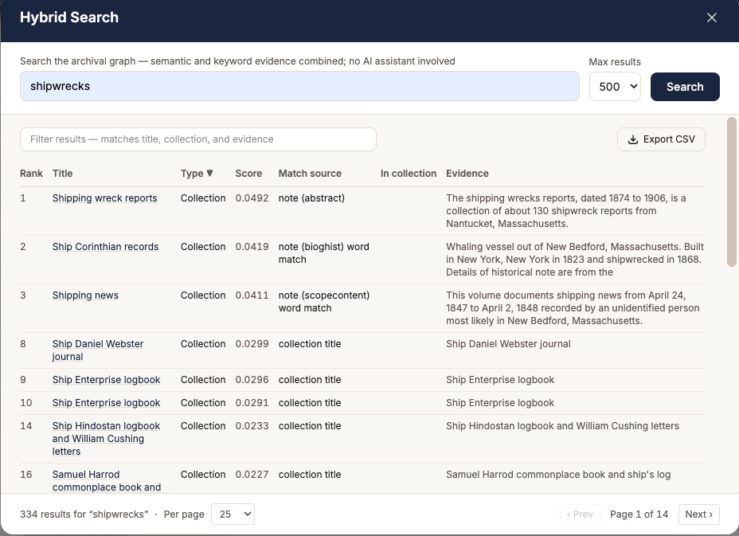
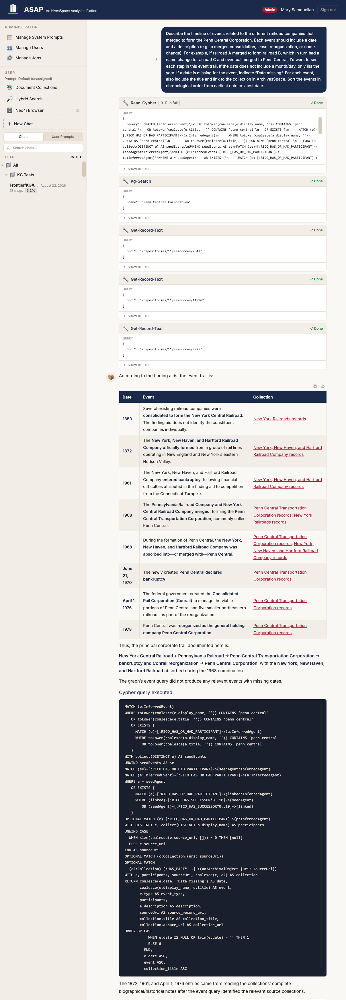
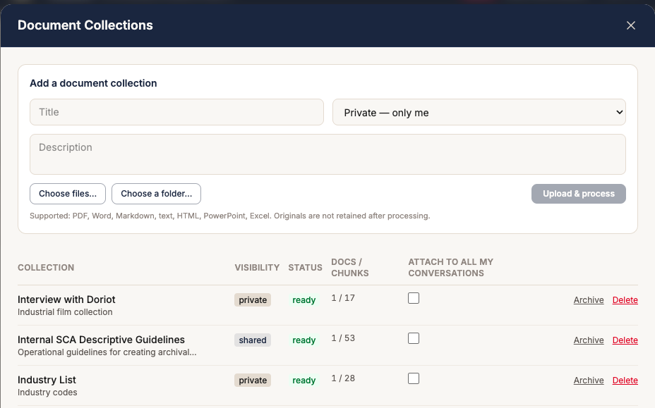
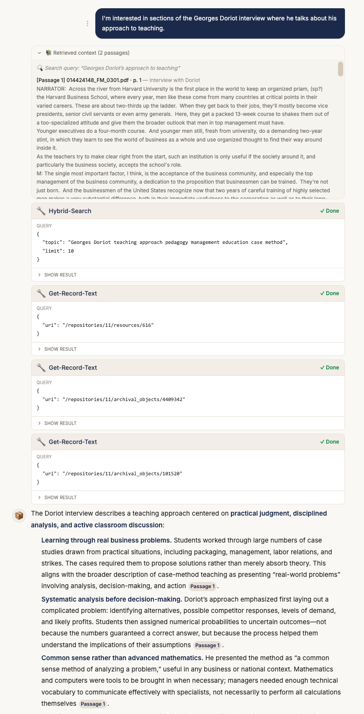
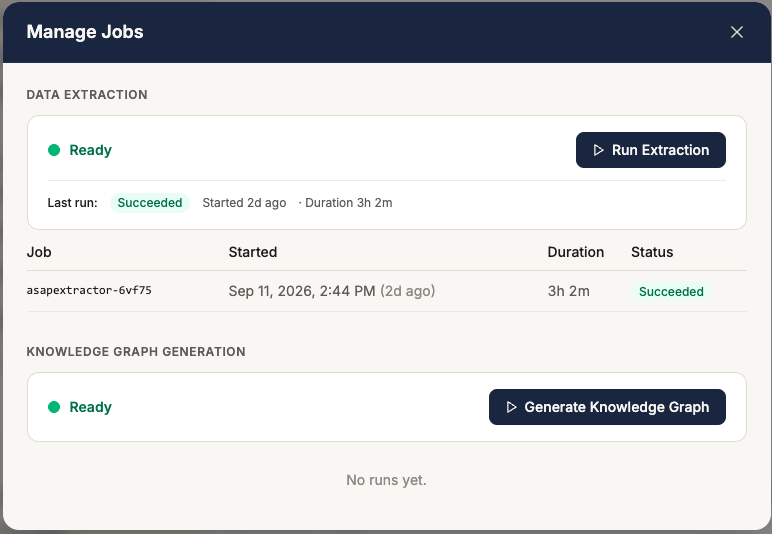

# ASAP — ArchivesSpace Analytics Platform

ASAP is a conversational analytics platform for archival collections. It
extracts the full descriptive record from an
[ArchivesSpace](https://archivesspace.org/) repository into a Neo4j graph,
layers an AI-generated knowledge graph of entities and relationships on top,
and lets archivists and researchers query all of it in plain language
through a chat interface backed by any OpenAI-compatible LLM — local
open-weight or commercial.

Everything runs in a local [k3d](https://k3d.io/) Kubernetes cluster; no
archival data leaves the machine unless you deliberately point the inference
endpoint at an external provider.

## What it does

- **Conversational analytics** — an agentic chat loop (any OpenAI-compatible
  model; gpt-oss-20b locally or GPT-5.6 via API in the pilot) with
  purpose-built tools: read-only Cypher, a
  server-side hybrid search, one-call record text retrieval, and knowledge
  graph lookups. The system prompt encodes archival terminology and query
  strategy; a tool allowlist and validator enforce read-only access.
- **Hybrid search** — semantic (bge-small embeddings via vLLM) and
  full-text evidence over titles, names, and notes, fused with weighted
  reciprocal rank fusion. Available to the chat agent and as a standalone
  search screen with CSV export.
- **AI-generated knowledge graph** — a pipeline (`kggenerator`) that reads
  each collection's narrative text, extracts entities (agents, places,
  events) and relationships typed with the
  [Records in Contexts](https://www.ica.org/resource/records-in-contexts-ric/)
  vocabulary, resolves duplicates across collections with LLM-adjudicated
  entity resolution, and loads the result as an isolated `:Inferred`
  subgraph — every node and edge carrying verbatim quotes and source-record
  provenance. See [docs/kg-conventions.md](docs/kg-conventions.md).
- **Charts** — the agent answers visualization requests with
  [Vega-Lite](https://vega.github.io/vega-lite/) specs, which the UI renders
  in place as interactive charts (bar, line, pie, mosaic) built only from
  tool results, with SVG/PNG export and a CSV download of the plotted data.
  After tabular answers it suggests a fitting chart type.
- **Document RAG** — user-uploaded document collections (e.g. DACS)
  chunked, embedded, and retrieved into chat with calibrated relevance
  gates and passage-level citations.
- **Admin jobs** — data extraction and knowledge-graph generation run as
  Kubernetes Jobs, triggered and monitored from the UI's admin panel.

## Screenshots


*Landing page — conversation folders and saved prompts on the left; suggested
questions, the Precise/Balanced/Exploratory temperature stop, a context-usage
meter, and attached document-collection chips on the right.*


*Hybrid Search — semantic and full-text evidence fused with weighted reciprocal
rank fusion, each row showing its match source and evidence excerpt;
filterable, exportable to CSV, and independent of the LLM.*


*Knowledge graph — a timeline question over the inferred graph. The agent
runs `read-cypher` against the `InferredEvent` nodes (note the **Run full**
button for executing the query directly), consults `kg-search` and
`get-record-text`, then answers with a cited event table and shows the Cypher
it executed.*


*Document Collections — upload reference documents (PDF, Word, Markdown, HTML,
PowerPoint, Excel) into private or shared collections and attach them to
conversations for RAG.*


*Document RAG — a question over an attached interview transcript (cropped to
the conversation column; the answer continues below). The retrieved-context
block shows the distilled search query and the cited passage; the agent also
consults the graph via tool calls, and the answer cites passages inline.*


*Manage Jobs (admin) — trigger and monitor the ArchivesSpace extraction and
knowledge-graph generation jobs, with run history.*

## Architecture

Ten services deployed by per-service Helm charts (see
[docs/architecture.mmd](docs/architecture.mmd) for the diagram):

| Service | Role |
|---|---|
| `asapui` | Svelte 5 SPA — chat, hybrid search screen, admin panel. Single front door; proxies `/api` to the backend |
| `asapbackend` | FastAPI — agentic chat loop, tools, RAG, job triggering, OIDC token validation |
| `asapextractor` | Job — full ArchivesSpace → Neo4j extraction (read-only against ASpace) |
| `kggenerator` | Job — knowledge graph extract → resolve → load pipeline |
| `asapdocworker` | Job — document ingestion (docling conversion, chunking, embedding) |
| `neo4j` | The graph: extracted records, note chunks + embeddings, knowledge graph, schema metadata |
| `neo4j-mcp` | MCP server exposing read-only Cypher to the agent |
| `postgres` | Conversations, users, document jobs, KG artifacts and resolution logs |
| `keycloak` (+ its own postgres) | OIDC authentication — public SPA client with PKCE, roles via JWT claim |
| `vllm` | bge-small-en-v1.5 embedding server |

LLM inference is served from outside the cluster by any OpenAI-compatible
endpoint (a commercial API, or LM Studio on the host at
`host.k3d.internal:1234`); the chat+RAG model and the knowledge-graph model
are configured independently. Only the embedding model runs in-cluster.

## Repository layout

```
packages/
  asapui/          Svelte 5 frontend
  asapbackend/     FastAPI backend (llm/, tools/, routers/, services/, prompts/)
  asapextractor/   ArchivesSpace → Neo4j extraction pipeline
  asapdocworker/   Document ingestion worker
  kggenerator/     Knowledge graph generation pipeline
helm/              One chart per service
scripts/           Cluster, build, install, and utility scripts
  data_analysis/   Read-only ArchivesSpace verification probes
docs/              Architecture diagram, knowledge-graph conventions, rollback manifests
manifests/         Cluster add-ons (CoreDNS custom config for host DNS)
ric/               Records in Contexts (RiC-O 1.1) ontology files
```

Python packages form a single [uv](https://docs.astral.sh/uv/) workspace.

## Getting started

Prerequisites: Docker, k3d, kubectl, helm, uv, Node 20+, and access to an
OpenAI-compatible LLM endpoint — a commercial API, or a local server such as
LM Studio (`openai/gpt-oss-20b` works well on Apple Silicon). You also need
read-only API credentials for an ArchivesSpace instance.

ASAP uses models in three independently configurable places, each set by its
own group of install flags: the **chat + RAG LLM** (`--inference-*`, one
model for the agent and the RAG-internal calls), the **knowledge-graph LLM**
(`--kg-inference-*`, extraction and adjudication), and the **embedding
model** (`--embedding-*`, defaults to the in-cluster vLLM serving
`BAAI/bge-small-en-v1.5`; `--embedding-api-key`, `--embedding-dimensions`,
and `--embedding-batch-size` allow a hosted embedding API). There are no
defaults for the two LLMs — by design, a missing coordinate fails loudly
rather than pointing at a phantom server. Changing the embedding model or its
dimensions requires re-running extraction, which rebuilds every vector index.

```bash
# 1. Create the cluster (persistent volumes live on the host filesystem)
./scripts/recreate-cluster.sh

# 2. TLS for the local ingress hosts
./scripts/setup-tls.sh

# 3. Build and push all service images
./scripts/docker-build-push.sh

# 4. Install every chart — ALL secrets are provided here, never in files
./scripts/install-charts.sh \
  --neo4j-password '<password>' \
  --pg-user '<user>' --pg-password '<password>' \
  --aspace-user '<username>' --aspace-password '<password>' \
  --keycloak-admin-password '<password>' \
  --inference-base-url 'https://api.openai.com/v1' --inference-model 'gpt-5.6-luna' \
  --inference-api-key '<key>' --inference-reasoning-effort none \
  --inference-min-p 0 --inference-temperature -1 \
  --kg-inference-base-url 'https://api.openai.com/v1' --kg-inference-model 'gpt-5.6-luna' \
  --kg-inference-api-key '<key>' --kg-inference-temperature -1 \
  --ui-host asapui.localhost --neo4j-host neo4j.localhost --keycloak-host keycloak.localhost

# 5. Create users in Keycloak, then open https://asapui.localhost
#    (.localhost hostnames resolve natively — no /etc/hosts entries needed)
```

First-time data load: sign in as an admin, open **Manage Jobs**, and run
**Data Extraction** (rebuilds the graph from ArchivesSpace, ~1.5 h), then
**Generate Knowledge Graph** (LLM extraction is incremental per collection;
resolution and load rebuild the `:Inferred` subgraph each run).

## Local development

Copy `.env.example` to `.env` and fill in values — it configures local runs
only; deployed pods get everything from Helm-created ConfigMaps and
Secrets. Then:

```bash
./scripts/dev-portforward.sh        # port-forward cluster services
uv sync                             # workspace environment
# Backend: F5 in VS Code (launch.json is configured), or:
uv run --project packages/asapbackend uvicorn asapbackend.main:app --reload
# UI dev server:
cd packages/asapui && npm run dev
```

Images are only rebuilt explicitly: after changing a service, run
`./scripts/docker-build-push.sh <service>` and restart its deployment —
repository edits alone never reach the cluster.

## Data principles

- **ArchivesSpace is never modified.** Every component that touches ASpace
  uses read-only GET requests. The extraction job rebuilds the Neo4j graph;
  it never writes back.
- **Derived data is isolated and labelled.** The AI-generated knowledge
  graph lives under `:Inferred` labels, never hard-linked to extracted
  records, with source URIs and verbatim quotes as provenance on every
  node and edge. Extraction and KG jobs each delete only their own data.
- **The agent cannot write.** LLM database access goes through the MCP
  server's read-only Cypher tool, an explicit tool allowlist, and
  call-time argument validation.
- **No secrets in the repository.** All credentials are supplied at
  install time via `--set` flags and live in cluster Secrets; local
  development credentials live in the git-ignored `.env`.
